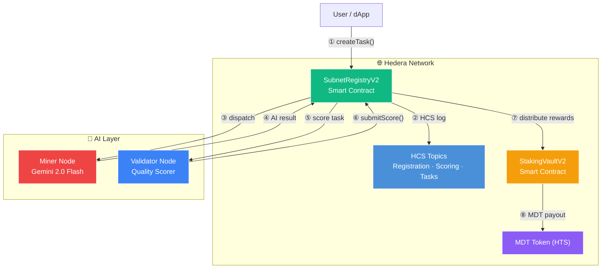

# 🎬 ModernTensor Hedera — Video Demo Script (5–7 min)

> **Goal:** Record a complete demo video for Hello Future Hackathon 2026.
> Track: **"AI & Agents"** — emphasize Trust, Reputation, Hedera.
> **Live Dashboard:** <https://moderntensorhedera.up.railway.app/>

---

## ✅ Pre-Recording Checklist

- [ ] Terminal font size **16–18pt**, dark theme
- [ ] `.env` file NOT visible on camera
- [ ] Miner running: Terminal 1 (`demo\start_T1_miner.bat`)
- [ ] Validator running: Terminal 2 (`demo\start_T2_validator.bat`)
- [ ] Dashboard open: <https://moderntensorhedera.up.railway.app/>
- [ ] HashScan tabs open (links at bottom of this file)
- [ ] Editor ready with `SubnetRegistryV2.sol` open
- [ ] Screen recorder set to **1920×1080**, 60fps

---

## Scene 1: Intro — Hero & Vision (30s)

**Show:** Dashboard → **Home tab** — Hero section: "VERIFIABLE NEURAL CONSENSUS on Hedera"

**Camera path:** Start from top → ticker bar → hero section → 4 role cards

**Say:**
> "Welcome to ModernTensor — a decentralized protocol for verifiable
> AI computation on Hedera.
>
> Miners provide AI compute. Validators score and verify results.
> Holders stake for passive income. And Requesters submit AI tasks
> to the marketplace. All on-chain, all verifiable."

**Highlight on screen:**
- Badge: `LIVE ON HEDERA TESTNET`
- 4 role cards: Miner (85% Yield), Validator (8% Yield), Holder (Pro-rata from reward), Requester (AI Results Delivered)
- Feature badges: `Proof of Intelligence`, `Immutable HCS Logs`, `Agent Micro-payments`, `MDT Staking Ready`

---

## Scene 2: Network & Token Overview (45s)

**Show:** Dashboard → Scroll down to **MDT/USDT Neural Market** chart + network stats

**Camera path:** Network info bar → Total Supply → Active Nodes → Throughput map

> ⚠️ **Note for presenter:** The price chart ($11.55, Market Cap, 24H Vol) is
> **simulated demo data** for UI showcase. Do NOT present it as real market data.
> Focus narration on the real on-chain elements: MDT token ID, supply, nodes, TPS.

**Say:**
> "The MDT token powers the entire network. It's a real HTS token
> deployed on Hedera testnet — token ID 0.0.8198586.
>
> The dashboard shows a simulated market view to demonstrate
> how the production interface will look. What IS real:
> Total supply of 1 billion MDT, 4,850 MDT currently staked,
> 30 active nodes, and over 12,000 transactions per second
> on Hedera's consensus layer."

**Highlight on screen:**
- Network info bar: `Consensus Layer: HEDERA HCS` | `Token: MDT - 0.0.8198586` | `Subnets: 3 ACTIVE` | `Network: TESTNET`
- Total Supply: **1,000,000,000 MDT** (real, on-chain)
- Total Staked: **4,850 MDT** (real, on-chain)
- Active Nodes: **30**
- Throughput: **12,402 TPS**
- ~~Price/Market Cap/Volume~~ → simulated for demo UI only

---

## Scene 3: Explorer — On-Chain Transparency (45s)

**Action:** Click **Explorer** tab

**Show:** Block explorer synced with Hedera Testnet Mirror Node

**Say:**
> "Our integrated explorer provides full transparency.
> You can search any Account, Transaction ID, or Block hash —
> everything is synced in real-time with the Hedera Mirror Node.
>
> Here you see the latest blocks with transaction counts,
> and the latest transactions with their consensus results.
> The network runs AOBFT consensus with sub-second finality."

**Highlight on screen:**
- Search bar: "Search Account (0.0.x), Transaction ID, Block, Hash..."
- Sync Status: **100%** (AOBFT, Sub-second)
- **Latest Blocks** table: Height, Transactions count, Age
- **Latest Transactions** table: ID/Type, Result, Age

---

## Scene 4: Subnets — Specialized AI Networks (60s)

**Action:** Click **Subnets** tab

**Show:** Overview stats + 3 subnet cards

**Say:**
> "ModernTensor supports specialized AI subnets, each focused on
> different computational tasks.
>
> Subnet 0 — General Intelligence — handles text generation and code.
> It commands 45% of network resources with 23 miners and 7 validators.
>
> Subnet 1 — Image Generation — for creating images and style transfer,
> with 30% resource allocation.
>
> Subnet 2 — Code Analysis — dedicated to code review and bug detection,
> with 25% of resources.
>
> Each subnet operates independently with its own miners, validators,
> and reward distribution."

**Highlight on screen:**
- Summary stats: **3 Protocols**, **23 Miners**, **7 Validators**, **34 Tasks**
- Card 1: **General Intelligence** — Text, Code — 45% share
- Card 2: **Image Generation** — Images, Style Transfer — 30% share
- Card 3: **Code Analysis** — Review, Bug Detection — 25% share
- Each card has an "Inspect Subnet" button

---

## Scene 5: Miners — AI Compute Providers (60s)

**Action:** Click **Miners** tab

**Show:** Miner stats + leaderboard table

**Say:**
> "The Miners tab shows all 23 active compute providers.
> Each miner has a Trust Score — a composite of task completion,
> response quality, and historical reliability.
>
> You can see their capabilities — Text, Image, Code — along with
> how much MDT they've staked, how many tasks they've completed,
> and their current status. Active miners with higher trust scores
> receive more task assignments."

**Highlight on screen:**
- Total: **23 Unique Miners**
- Avg Trust Score: ~**4331.4%**
- Table columns: Miner ID (0.0.x), Subnet, Capabilities, Stake (MDT), Tasks, Trust Score (progress bar), Status (ACTIVE/IDLE)
- Sample: `0.0.8117148` — Stake 1,000 MDT — ACTIVE

---

## Scene 6: Validators — Quality Assurance (60s)

**Action:** Click **Validators** tab

**Show:** Validator rankings + Live Validation Feed

**Say:**
> "Validators are the quality gatekeepers. We have 7 validators
> with an average confidence of 81%.
>
> What's unique is our reputation-weighted scoring. Each validator's
> reward depends on three factors: accuracy compared to median,
> accumulated reputation, and stake amount.
>
> Watch the Live Validation Feed — you can see validators scoring
> miners in real-time. Validator A just scored Miner B at 40.8 points
> for a text generation task."

**Highlight on screen:**
- Total: **7 Validators**
- Avg Validations: **61 scores**
- Avg Confidence: **81%**
- Rankings table: Rank, Validator ID, Validations count, Avg Score, Confidence
- **Live Validation Feed**: real-time scoring events (Validator → Miner → Score → Task)

---

## Scene 7: Tasks — AI Marketplace (60s)

**Action:** Click **Tasks** tab

**Show:** Task stats + category filters + task table + Submit button

**Say:**
> "The Tasks page is the AI marketplace in action.
> 34 tasks have been submitted, with 21 already completed.
>
> You can filter by category — Text, Code, Summarization, Optimization.
> Each task shows its prompt, reward amount, and completion status.
>
> And here's the key — anyone can submit an AI task by clicking
> this Submit Task button. The task goes on-chain via SubnetRegistry,
> gets dispatched to the best available miner, scored by validators,
> and rewards are distributed — all automatically."

**Highlight on screen:**
- Stats: **34 Total Tasks**, **21 Completed**
- Category filters: All, Text, Code, Summarization, Optimization
- **SUBMIT TASK** button (pink neon)
- Table: Task ID, Type, Prompt (task content), Reward (MDT), Status (COMPLETED/PENDING)

---

## Scene 8: Tokenomics — Economic Model (45s)

**Action:** Click **Tokenomics** tab

**Show:** Supply breakdown + Yield Console calculator

**Say:**
> "The Tokenomics page shows the full economic model.
> MDT has a max supply of 21 million, with 14.2 million in circulation —
> that's about 67.6%.
>
> The interactive Yield Console lets you calculate expected returns.
> Slide to 1,000 MDT stake — you get daily and monthly projections
> based on current network activity.
>
> Hit 'Initialize Staking' to start earning. StakingVaultV2 uses
> EIP-1559-style dynamic fees that get burned — making MDT
> progressively deflationary."

**Highlight on screen:**
- Circulating Supply: **~14.2M** (67.6%)
- Max Supply: **21.0M**
- **Yield Console**: interactive slider (stake amount → projected returns)
- Daily/Monthly output projections
- **INITIALIZE STAKING** button

---

## Scene 9: Live Demo — Submit & Verify (60s)

**Action:** Run `demo\start_T3_live_tasks.bat` or `python scripts/demo_video_e2e.py`

**Show:** Terminal + Dashboard Tasks tab side-by-side

**Say:**
> "Now let's run a real AI task end-to-end.
> I'm submitting a text generation task on-chain via SubnetRegistry.
> Watch the terminal — the task is created, dispatched to our
> Gemini-powered miner, processed, and the result hash is
> submitted back to Hedera.
>
> Switch to the Tasks tab — there it is, completed with full
> on-chain verification. Click 'Verify on HashScan' to see
> the raw HCS messages — complete transparency, no black box."

**Highlight on screen:**
- Terminal output: task creation → AI processing → result hash → verification links
- Dashboard: new task appearing in Tasks table with COMPLETED status
- **VERIFY ON HASHSCAN** button → HashScan explorer

---

## Scene 10: Architecture Recap (30s)

**Show:** Dashboard Home tab → Subnet Performance table → Verify on HashScan button

**Say:**
> "To recap — every step is on Hedera. Task creation, AI processing,
> quality scoring, and reward distribution — all verifiable, immutable,
> and transparent through HCS and HTS."

---

## Scene 11: Outro — Why Hedera (30s)

**Show:** Dashboard Home hero section

**Say:**
> "We chose Hedera because:
> - HCS gives fast, ordered consensus messaging for task coordination
> - HTS provides native token support — no custom ERC-20 needed
> - Sub-second finality means miners and validators get paid fast
> - Low fees make micro-payments for AI tasks viable
>
> ModernTensor — Verifiable Neural Consensus on Hedera.
> Built for Hello Future Hackathon 2026. Thank you for watching!"

---

## 📋 Video Recording Order (Recommended)

| # | Scene | Tab/Screen | Duration |
|---|-------|------------|----------|
| 1 | Intro & Vision | Home — Hero | 30s |
| 2 | Market & Network | Home — Market + Stats | 45s |
| 3 | Explorer | Explorer tab | 45s |
| 4 | Subnets | Subnets tab | 60s |
| 5 | Miners | Miners tab | 60s |
| 6 | Validators | Validators tab | 60s |
| 7 | Tasks | Tasks tab | 60s |
| 8 | Tokenomics | Tokenomics tab | 45s |
| 9 | Live Demo | Terminal + Tasks tab | 60s |
| 10 | Architecture | Home — bottom | 30s |
| 11 | Outro | Home — Hero | 30s |
| | **TOTAL** | | **~8.5 min** |

> 💡 **Tip:** Có thể cắt Scenes 5–6 (Miners/Validators) thành tóm tắt ngắn hơn
> nếu muốn giữ video dưới 7 phút.

---

## 🔗 HashScan Links (open before recording)

| Resource | URL |
|----------|-----|
| SubnetRegistryV2 | <https://hashscan.io/testnet/contract/0.0.8101733> |
| StakingVaultV2 | <https://hashscan.io/testnet/contract/0.0.8101730> |
| MDT Token | <https://hashscan.io/testnet/token/0.0.7852345> |
| Account | <https://hashscan.io/testnet/account/0.0.7851838> |
| HCS Governance | <https://hashscan.io/testnet/topic/0.0.7852335> |
| HCS Scoring | <https://hashscan.io/testnet/topic/0.0.7852336> |
| HCS Task | <https://hashscan.io/testnet/topic/0.0.7852337> |
| Live Dashboard | <https://moderntensorhedera.up.railway.app/> |

---

## 🎨 Dashboard Design Notes (for reference)

- **Theme:** Cyberpunk dark — deep black (#0a0f1e) with neon cyan (#00f3ff) and neon magenta accents
- **Ticker bar:** Scrolling live stats (MDT Price, Market Cap, 24H Vol, Total Staked)
- **Navigation:** 7 tabs — Home, Explorer, Subnets, Miners, Validators, Tasks, Tokenomics
- **Interactive elements:** Yield calculator slider, Submit Task button, Inspect Subnet buttons, Verify on HashScan
- **Data refresh:** Real-time via Hedera Mirror Node sync
